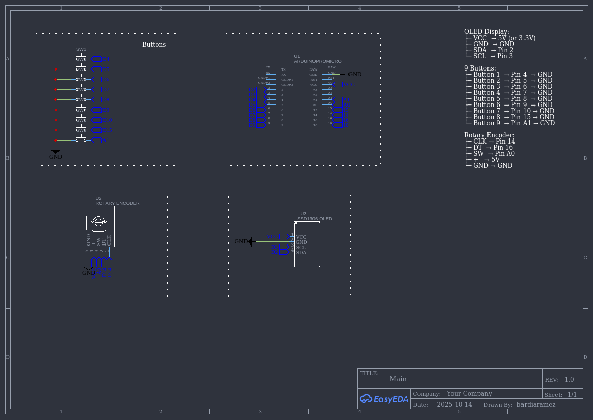

# Keyboard DIY — Multi-Mode Macro Keypad


This repository holds an Arduino sketch for a small multi-mode macro pad with an OLED, a rotary encoder and 9 buttons. It supports five modes (Basic, Media, Code, Custom and a small Dino game). The device uses USB HID to send keyboard and consumer/media control events to the host.

## Highlights

- 9 buttons with configurable shortcuts across 5 modes
- Rotary encoder for mode changes and optional volume control (press encoder to toggle)
- 128x64 I2C OLED (SSD1306) for mode and animation feedback
- Simple built-in Dino mini-game in Mode 5
- Written using HID-Project and Adafruit SSD1306/GFX libraries

## Files

- `main.ino` — The full Arduino sketch (core of the project).

## Hardware / Wiring

This sketch was written for a 32U4-based board (Arduino Pro Micro, Leonardo or similar) because it uses the native USB HID libraries.

### Wiring Diagram



```
OLED Display (SSD1306 128x64 I2C):
├─ VCC  → 5V (or 3.3V depending on module)
├─ GND  → GND
├─ SDA  → Pin 2 (I2C Data)
└─ SCL  → Pin 3 (I2C Clock)

9 Buttons (active-low with internal pull-up):
├─ Button 1  → Pin 4  → GND
├─ Button 2  → Pin 5  → GND
├─ Button 3  → Pin 6  → GND
├─ Button 4  → Pin 7  → GND
├─ Button 5  → Pin 8  → GND
├─ Button 6  → Pin 9  → GND
├─ Button 7  → Pin 10 → GND
├─ Button 8  → Pin 15 → GND
└─ Button 9  → Pin A1 → GND

Rotary Encoder (with push button):
├─ CLK → Pin 14
├─ DT  → Pin 16
├─ SW  → Pin A0 (push button)
├─ +   → 5V
└─ GND → GND
```

### Notes

- **OLED**: I2C address is 0x3C (default for most SSD1306 modules). Connect SDA/SCL to your board's I2C pins (on Pro Micro: Pin 2 = SDA, Pin 3 = SCL).
- **Buttons**: All button pins are configured with `INPUT_PULLUP`, so wire one side of each button to the specified pin and the other side to GND. Pressing a button pulls the pin LOW.
- **Encoder**: Uses `INPUT_PULLUP` on CLK, DT, and SW. The code expects a standard mechanical rotary encoder with quadrature output (Gray code). The SW pin is the encoder's push button.

## Dependencies (Arduino Libraries)

- HID-Project (for Keyboard and Consumer/media controls)
- Adafruit_GFX
- Adafruit_SSD1306
- Wire (built-in)

Install these from the Arduino Library Manager or use PlatformIO.

## How it works — critical sections explained

- Encoder handling (`handleEncoder`): reads CLK/DT and uses a small Gray-code state table to determine rotation direction reliably. Encoder steps either change modes (default) or send volume up/down events when the encoder is toggled into volume mode by pressing it.

- Encoder push button: toggles `encoderVolumeMode`. A brief on-screen message is shown when toggled.

- Buttons (`handleButtons`): reads 9 hardware buttons (active low). When a button press is detected it calls `executeShortcut` which forwards to the current mode handler.

- Modes (`executeMode1`..`executeMode5`): 5 mode handlers are implemented. Each maps button indexes (0..8) to actions. Actions use `Keyboard` (HID) for keyboard combos and `Consumer` for media keys. Some helpers exist:
  - `sendKeyCombo(key1, key2)` — press two keys (or hold a single key if second is 0)
  - `sendKeyCombo3(key1, key2, key3)` — press three keys together

- OLED UI: `showModeChange()` briefly draws a big mode notification. `showMessage()` shows short on-screen messages. `drawModeAnimation()` draws a small animation per mode. For Mode 5 the sketch contains a playable Dino game (`startDinoGame`, `updateDinoGame`, `drawDinoGame`).

## Customization

- Change key mappings: edit `executeModeX` functions in `main.ino`.
- Change pin assignments: edit the `buttonPins` array and encoder pin defines near the top of `main.ino`.
- Change OLED address or size: edit `display.begin(...)` and `SCREEN_WIDTH/HEIGHT` constants.

## Build & Upload

Using Arduino IDE:

1. Install the libraries from Library Manager: `HID-Project`, `Adafruit GFX`, `Adafruit SSD1306`.
2. Select the correct board (e.g. "Arduino Leonardo" or "Pro Micro (ATmega32U4)").
3. Select the correct port.
4. Upload.

Using PlatformIO (recommended for reproducible builds):

1. Create a new PlatformIO project for your target board (e.g. `leonardo` or `pro16MHzatmega32U4` depending on your Pro Micro variant).
2. Add the needed libraries to `platformio.ini` or use lib_deps:

```ini
[env:pro16MHzatmega32U4]
platform = atmelavr
board = pro16MHzatmega32U4
framework = arduino
lib_deps =
  hid-project
  adafruit/Adafruit GFX Library
  adafruit/Adafruit SSD1306
```

3. Put `main.ino` into `src/` and build/upload with PlatformIO.

## Troubleshooting

- If HID (Keyboard/Consumer) doesn't work, ensure your board is indeed a native USB device (32U4 family). Boards based on CH340/FTDI won't provide native HID.
- If the OLED does not show anything, verify I2C wiring and address (0x3C is common). Use an I2C scanner to confirm.
- If encoder behaves jittery, add small debouncing or use an encoder library. The code already uses a state table but mechanical jitter can still create multiple transitions.

## Security & Safety

- This project sends keyboard events to the connected host. Use responsibly and avoid sending keystrokes to untrusted machines.

## GitHub / Repo tips

Recommended repo description: "Multi-mode macro pad with OLED, rotary encoder and a Dino mini-game — Arduino HID".

Suggested topics: arduino, hid, macro-pad, oled, encoder, ssd1306

To push this folder to GitHub (run these from the project root):

```bash
git init
git add .
git commit -m "Initial commit: keyboard-diy main.ino + README + LICENSE"
gh repo create <your-username>/keyboard-diy --public --source=. --remote=origin
git push -u origin main
```

Replace the `gh repo create` command with your own remote setup if you don't use GitHub CLI. If your default branch is `master` adjust commands accordingly.

## License

This repository is licensed under the MIT License (see `LICENSE`).

---

If you want, I can:

- add a PlatformIO project skeleton (platformio.ini)
- add a board-specific README section (Pro Micro vs Leonardo)
- try a local compile if you tell me which board you plan to use

Tell me which of the above you'd like next and I'll proceed.
